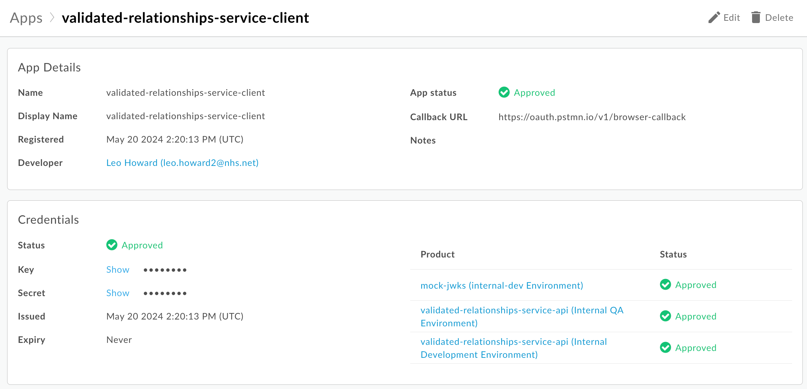

# Proxy Relationship Validation Service Automated Testing

The goal of these tests is to repeatedly and automatically demonstrate the readiness of the Proxy Relationship
Validation Service and its underlying components and infrastructure.

Testing is done 'in the cloud'. That is in an environment as close to production as we can get.

There are three strategies intended to support this:

- End to End API testing - does the API we present behave as our consumers expect? These tests can be found in
  the [test_api](test_api) directory.
- Component testing - do the individual components of the service behave as expected? These tests can be found in
  the [test_lambdas](test_lambdas) directory. As well as the [test_step_functions](test_step_functions) directory.
- Infrastructure testing - does the AWS infrastructure behave as expected?
- Weekly tests - these are run on a schedule and are intended to be run in the cloud less frequently than the other tests.

## Dependencies

- An APIGEE nonprod account. You can request this via the `Apigee Non-prod Account` workflow on
  the `#platforms-apim-producer-support` Slack channel.
- [APIGEE get_token](https://docs.apigee.com/api-platform/system-administration/auth-tools) utility
- [poetry](https://python-poetry.org)
- [AWS credentials configured](https://docs.aws.amazon.com/cli/latest/userguide/sso-configure-profile-token.html#sso-configure-profile-token-auto-sso)
- make

## First time Set up

Install dependencies with:

```
poetry install
```

Follow these [instructions](https://nhsd-confluence.digital.nhs.uk/display/APM/Test+Utils+2.0%3A+pytest+plugin+for+APIM)
to set up access to APIGEE.

Set the SSO LOGIN URL for Apigee with:

```
export SSO_LOGIN_URL=https://login.apigee.com
```

### AWS Profiles

The following AWS profiles are needed to execute the various tests.

```
[profile nhs-dev]
sso_start_url = [SSO_URL]
sso_account_id = [SSO_AccountID]
sso_role_name = NPA-Developer
sso_region = eu-west-2
region = eu-west-2
output = json

[profile nhs-dev-non-sensitive]
sso_start_url = [SSO_URL]
sso_account_id = [SSO_AccountID]
sso_role_name = NPA-Nonsensitive-Reporting
sso_region = eu-west-2
region = eu-west-2
output = json

[profile nhs-dev-sensitive]
sso_start_url = [SSO_URL]
sso_account_id = [SSO_AccountID]
sso_role_name = NPA-Sensitive-Reporting
sso_region = eu-west-2
region = eu-west-2
output = json
```

To run the infrastructure tests you also need:

```
[profile nhs-dev-admin]
sso_start_url = [SSO_URL]
sso_region = eu-west-2
sso_account_id = [SSO_AccountID]
sso_role_name = Admin
region = eu-west-2
output = json
```

Where

- `[SSO_URL]` is the aws start url
- `[SSO_AccountID]` is the account id

Once the profiles have been configured, the tester should login to AWS using the command

`aws sso login --profile=nhs-dev`

In addition, the tester should login to the `sensitive` and `non-sensitive` profiles at least once they have been
configured using the commands.

`aws sso login --profile=nhs-dev-sensitive`
`aws sso login --profile=nhs-dev-non-sensitive`

More details on how to configure AWS are available in
confluence - https://nhsd-confluence.digital.nhs.uk/display/NPA/AWS+Configuration

### Environment variables

The following environment variables are needed for the tests to work across environments and workspaces

| Name          | Default | Description                                  |
| ------------- | ------- | -------------------------------------------- |
| `WORKSPACE`   | `main`  | The workspace to use for the tests           |
| `ENVIRONMENT` | `dev`   | The environment these tests are being run on |

## Prerequisites for running the tests (per session)

### Component & Weekly tests

Profile name is the name of the AWS profile you've set up in your AWS config file and want to use for the tests. For
example, `nhs-dev`.

```bash
aws sso login --profile={profile_name}
export AWS_PROFILE={profile_name}
```

### Infrastructure and API Tests

Profile name is the name of the AWS profile you've set up in your AWS config file and want to use for the tests. For
example, `nhs-dev`.

```bash
export SSO_LOGIN_URL=https://login.apigee.com
aws sso login --profile={profile_name}
export AWS_PROFILE={profile_name}
```

### Load Tests

The current implementation of these [tests](test_load/locustfile.py) is via the use
of [Locust](https://locust.io/). The GitHub page can be found [here](https://github.com/locustio/locust).
You will need to ensure you have set your email up in Apigee for the validated-relationships-service-client App:

Profile name is the name of the AWS profile you've set up in your AWS config file and want to use for the tests. For
example, `proxy-QA`.
The tests can currently only be run on `main`.

```bash
export SSO_LOGIN_URL=https://login.apigee.com
aws sso login --profile={profile_name}
export AWS_PROFILE={profile_name}
```

## Running the tests

Run the End to End API tests with:

```
// To run the tests without getting a token or in case the token is already available (such as in CI)
make test-api

// To run the tests with getting an apigee access token
make test-api-with-get-token
```

### Lambda tests

Run the lambda tests with:

```bash
make test-lambdas
```

### Step function tests

Run the step function tests with:

```bash
make test-step-functions
```

### Infrastructure tests

Run the infrastructure tests with:

```bash
// To run the tests without getting a token or in case the token is already available (such as in CI)
make test-infra

// To run the tests with getting an apigee access token
make test-infra-with-get-token
```

### Weekly tests

Run the weekly tests with:

```bash
make test-weekly
```

### Performance/Load tests

Run the Performance/Load tests with:

```bash
// This will run Locust in headless mode (no UI) simulating 5 users with a spawn rate of 1 user per second
// It targets the URL https://internal-dev.api.service.nhs.uk/validated-relationships/FHIR/R4

make test-performance-with-get-token DEVELOPER_EMAIL={your.email@nhs.net}
```

If you want to pass any additional arguments to `pytest` you can do so by running make with the `PYTEST_ARGS` argument

e.g.

```bash
make test-api-with-get-token PYTEST_ARGS='-m phase_two'
```

Will only run scenarios and/or features marked as `@phase_two`

```bash
make test-api-with-get-token PYTEST_ARGS="-m 'phase_two and not skip'"
```

Will run scenarios and/or features marked as `@phase_two` but not tests marked as `@skip`

Run the Load tests with:

```
// This will run Locust in headless mode (no UI) simulating 5 users with a spawn rate of 1 user per second
// It targets the URL https://internal-qa.api.service.nhs.uk/validated-relationships/FHIR/R4

make test-load-with-get-token DEVELOPER_EMAIL={your.email@nhs.net}

```

Run just the /RelatedPerson Load tests with:

```
make test-load-relationship-validation-with-get-token DEVELOPER_EMAIL={your.email@nhs.net}

```

Run just the /QuestionnaireResponse Load tests with:

```
make test-load-questionnaire-response-with-get-token DEVELOPER_EMAIL={your.email@nhs.net}
```

# Writing End to End API tests

The End to End API tests use [pytest-bdd](https://pytest-bdd.readthedocs.io/en/stable/) to allow us
to write [Behaviour Driven Development](https://cucumber.io/docs/bdd/) tests in the
[Gherkin](https://cucumber.io/docs/gherkin/) language.

This allows us to write English language tests using the "Given, When, Then" structure, for example:

```
Feature: Relationship Validation

  Scenario Outline: Confirm a valid relationship between a specific mother and child (No _include parameter)
    Given the Relationship Validation Service API is available
    When the client calls '/RelatedPerson' with identifier <identifier> and patient:identifier <patient_identifier>
    Then the Relationship Validation Service will return 200
    And the response will be JSON
    And the request will match the API Spec
    And the response will match the API Spec

    Examples:
      | identifier | patient_identifier |
      | 9730675929 |         9730676399 |
```

The steps in these tests are then implemented as step definitions by
Python functions in [test_step_definitions.py](test_api/test_step_definitions.py).

## Setting the API version

The End to End API tests use [openapi-core](https://openapi-core.readthedocs.io/en/latest/)
to validate the exchange between the tests and the API. The version of the API used is
specified in [conftest.py](conftest.py). It points to the URL for raw version of the
API specification in
the [validated-relationships-service-api](https://github.com/NHSDigital/validated-relationships-service-api) repo.

By default it uses the version of the spec on the `master` branch. To use a different branch set
the `API_SPEC_BRANCH` environment variable e.g.

```
export API_SPEC_BRANCH=NPA-2459_Change_Authorisation_Spelling
```

## Asserting expected results

Within a step definition there are two options for how to assert that the expected result has been found.
First is to use a regular `assert` e.g.

```python
assert (
        api_response.status_code == 200
), f"Here is the response body content: '{api_response.json()}'"
```

Adding some descriptive text to the `assert` helps identify why tests are failing.

The second way is to use [Python-Delayed-Assert](https://github.com/pr4bh4sh/delayed-assert).
This is used when we want to capture the fact that an assert has failed but carry on with the test.
We do this because `pyest-bdd` will stop running a scenario at the first assert meaning that
subsequent steps are not run. This is fine if we want to fail early and fix errors as soon as
we find them but there are cases where this is not possible. For example, if a failure is due
to changes in the API spec which have not yet been implemented we can flag this. e.g.

```python
try:
    openapi.validate_response(openapi_request, openapi_response)

except InvalidData as error:
    delayed_assert.expect(False, str(error))
```

The above test checks that the structure of the response returned by the VRS matches the
spec. Ideally we would ensure that this is always the case but historically there has been a
delay in getting the implementation to match the spec so using a delayed assert allows us
to flag that there is an issue but carry on and test the rest of our expected behaviour
rather than having the rest of the steps in the scenario be ignored.

# Linting

These tools are available for linting:

- [black](https://github.com/psf/black)
- [pylint](https://github.com/pylint-dev/pylint)
- [isort](https://pycqa.github.io/isort/) - run with `--profile black` for `black` compatibility

## See also

[Testing with mock auth](https://nhsd-confluence.digital.nhs.uk/display/APM/Testing+with+mock+auth)
